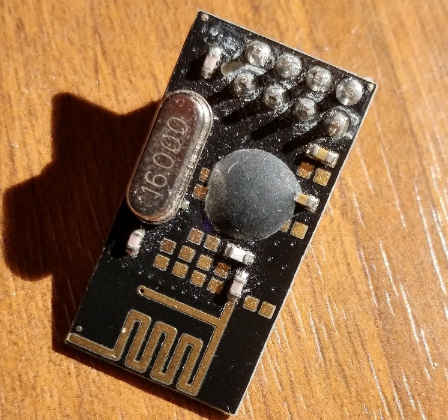
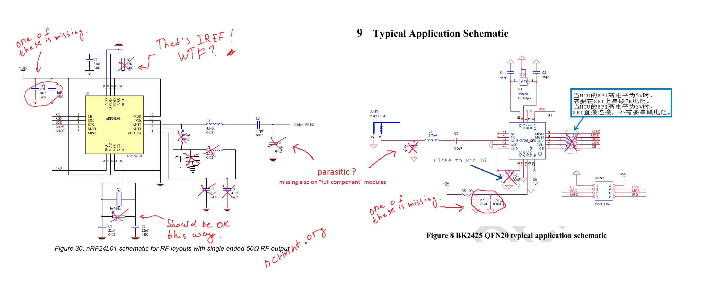
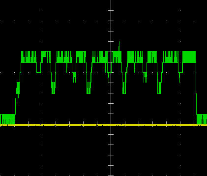

#RFM7x library

This is library intended to use with bk2421/bk2423/bk2425 chips commonly known as RFM70/RFM73/RFM75 or even more other rebrands like LCX24A(G?), TRW-24G2, SQI73/SQI75 and of course "not working" nrf24l01+ (cob) fakes.

In order to force those modules to work as intended, special initialization sequence have to be followed:

1. All status registers in `BANK0` have to be initialized (0x07 for `STATUS`, 0x00 for the rest) - otherwise doesn't work (even if it works without, it might fail after some time)
2. BANK1 registers have to be initialized with predefined undocumented values which are different among datasheets. 
3. All reserved registers in `BANK1` have to be initialized.
4. After power-up 1 or 2 bits in reg4(`BANK1`) have to be toggled

Unlike the nRF24/SI24R1, clearing `MAX_RT` interrupt request is not enough.
In this case `FLUSH_TX` command have to be also executed (`TX_REUSE` ???), to unlock any further transmissions.

- other differencies can be found in application notes
- all documentations says about 83 available channels, but tests show that all 127 channels can be used.
- all modules except bk2425 (rfm75) are said to be 5V (IO) tolerant but "that's not the case".

In almost all nRF24 fakes, any kind of power noise, missing decoupling, or even anything around within few meters, may result in increased packet drop rate.
Even though properly initialized bk242x chips are more stable (noise immune) than SI24R1, it still requires additional bypass caps.

##how to examine fakes

Usually the exact fake model can be determined by overall module design or measuring current consumption.
The following function should reveal any bk24xx chip: (SE8R01 still not tested)

```
uint8_t rfm7x_is_present(void)
{
 	uint8_t tmp1, tmp2;
 	tmp1 = rfm7x_reg_read(RFM7x_REG_STATUS);
 	rfm7x_reg_write(RFM7x_CMD_ACTIVATE, 0x53);
 	tmp2 = rfm7x_reg_read(RFM7x_REG_STATUS);
 	rfm7x_reg_write(RFM7x_CMD_ACTIVATE, 0x53);
 	return (tmp1 ^ tmp2) == 0x80;
}
```

##worst nrf24l01+ fakes



This is one of the most chinesed chinese nRF24l01+ fake. 
It is assumed to be SI24R1 and always opens discussion about legality of missing RF filtering, but after some testing it turns out to be ordinary bk2425.
If we look at schematics, there is not much missing:


 
##NO_ACK bit

> The re-marked nRF24L01P (+) clones are not 100% register compatible. The issue with the counterfeit devices is that when they enabled “Dynamic Payload Length” (EN_DPL) in the "FEATURE" register, one bit get’s activated in the on-air payload (the NO_ACK bit) This bit should be active high (according to the Nordic datasheet), but it’s actually implemented the other way around. When EN_DPL is activated, the NO_ACK bit get reversed in the real nRF-devices. They did such a good job of cloning they cloned the datasheet error into the device!!!

Inversion of NO_ACK bit in the air payload can be controlled by the undocumented `compatible mode` bit in one of the bank1 registers. 
It can also be changed with simple `RFM7x_CONFIG_COMPATIBLE_MODE` macro in cofig header.

- To communicate with SI24R1, it have to be set into `static compatible` mode 
- Otherwise "dynamic compatible" mode is recommended (genuine nrf?)
 
##high power mode

AN0007 describes non-existent settings for `high power/current` mode in bk2423 (rfm73).
It is said to output up to 15 dBm and require additional low-pass filter to pass FCC tests.




##PA/LNA modules
Standalone RFM's were not weird enough so the 'P' version was introduced.

- RFX2401C datasheet specifies +5 dBm input power as **ABSOLUTE MAXIMUM**, but saturation output power is +22dBm with 25 (28 for E) dB of 'small signal' gain, so it expects 0dBm or even less of TX power ("chinese replacements" might have similiar limits)
	- "high power" mode in bk2423 is not allowed here.
	- if module can't communicate for longer distances (usually more than 5 meters), try lowering power levels, even down to -20dBm.
- HOPERF claims that their "chinese replacement" of RFX2401 (C,E,- ??) works up to 4.2V, although RFAXIS reccomends typical 3V3 operation, with 4.0V (4.5V for E), as an **ABSULUTE MAXIMUM**. It also might be the case of increasing signal gain and thus saturating PA.
- Auto ACK is not possible since TREN (TXEN) signal is broken out on header instead of connecting it to the VDDPA output.
- PAEN (RXEN) is activation signal for PA/LNA chip, it can be tied high if you don't care about power consumption.

##RFM70p/73p

Those modules requires hardware modification to act as a regular rfm7x with auto retransmissions and ACK.
It has been done back in 2013 [here](http://www.elektroda.pl/rtvforum/topic2659984.html).

- VDDPA (between C3,L2) have to be conected to TREN (TXEN) input of RFX through 1K resistor.
- It is recommended to create additional lowpass (RC/LC) filter while connecting directly to (VDDPA)RF path. 
- cutting TREN trace next to the vias is also recommended.


##RFM75p

This module uses bk2425 chip which is a (BOM) cost optimized one, thus it doesn't have VDDPA output.
Internal PA leaks only 300mV (LNA about 50mV) DC offset into antenna path, so it could be somehow possible to extract PAEN signal.

##todo:
- add PAEN line support
- add missing config functions
- add missing examples
- interrupts and status flags
- clearing MAX_RT//TX_REUSE ??
- mesh networks
- test ranges / harmonics
- other architectures (includes ?/ optimize ?)
- arduino
- any suggestions what could be added/changed are welcome